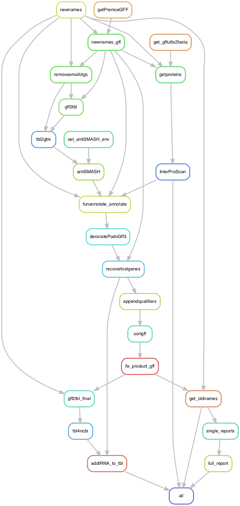

# gff2function: doing functional annotation of *Podospora* genomes with Funannotate

In this pipeline I attempt to create functional annotation from the gff3 files produced by my pipeline `PaAnnotation.smk`. Genome annotation is a painful process with many, many tools, so I ended up using a mixture of modules from the [UPPMAX](https://www.uppmax.uu.se/) cluster in Sweden, and conda environments. This is, of course, not ideal for reproducibility, but hopefully peolple at least get an idea of what to do *after* you managed to install everything.

The goal of this pipeline is not only to produce functionally annotated gff files, but also prepare tbl files for submission to NCBI for the focal strains: CBS124.78p, CBS411.78m, CBS415.72m, and CBS112042p. The results still needed work for NCBI submission, in particular because I had to do the mitochondrial annotation separately.

	$ cd 2_FunctionalAnnotation

## The input files

The input files for this pipeline are specified in a configuration (`config/config.yaml`), which **has to be modified to match your local paths**!! These are:

```yaml
## Configuration file for the PaFunannotate pipeline: second version 
# ---------------------------------------------------
# Paths and files
path2assemblies: "../5d_Annotation_v3/data/genomes"
path2samples: "../5d_Annotation_v3/results"
path2orthos: "../5d_Annotation_v3/renaming"
knownproducts: "data/annotation/KnownProducts_20230608.txt"
pseudogenes: "data/annotation/pseudogenes.txt"

# Scripts I made for this pipeline
decoratePodoGff3: "scripts/decoratePodoGff3.py"
mergeGFFs: "scripts/mergeGFFs.py"
appendQualifierGff: "scripts/appendQualifierGff.py"
fixProductGff: "scripts/fixProductGff.py"
tbl4ncbi: "scripts/tbl4ncbi.py"
addtRNA2tbl: "scripts/addtRNA2tbl.py"

annotationversion: "3.00"

# Samples
longassemblies: ["CBS112042p", "CBS237.71m", "CBS411.78m", "CBS415.72m", "PaTgp", "PaWa137m", "PaYp", "PcWa139m", "CBS124.78p",
      "PaWa100p", "PaWa21m", "PaWa28m", "PaWa46p", "PaWa53m", "PaWa58m", "PaWa63p", "PaWa87p", "PaYm",
      "Podan2", "PODCO"]

shortassemlies: ["CBS253.71p", "CBS307.81m", "CBS333.63p", "CBS451.62p", "PcWa131m", "PcWa132p", "PcWa133m", "PaZp", "CBS433.50p", "CBS455.64m"]

```

I also used `.sbt` files produced in NCBI for the samples I wanted to submit in an attempt to get submission-ready files from Funannotate but that didn't work out. I still have them in the pipeline and they are in the folder `data/GenBankSubTemplate`.

At least one more script is downloaded automatically by the pipeline from my GitHub.

# Installing Funannotate v1.8.15 in Uppmax: the only one that worked with EggNog

I made a general environment with conda:

	$ mamba create -n funs funannotate=1.8.15 snakemake-minimal=7.25.0 eggnog-mapper=2.1.10

Even tho it's installed, I had to do this manually to download the EggNog database (about 6.31G compressed):

	$ mkdir /proj/sllstore2017101/private/b2015200/miniconda3/envs/funs/lib/python3.8/site-packages/data
	$ download_eggnog_data.py -F -P -M

This downloaded the database `emapperdb-5.0.2`.

Download/setup databases to a writable/readable location

	$ funannotate setup -d $HOME/funannotate_db

Configure

	$ echo "export FUNANNOTATE_DB=$HOME/funannotate_db" > /proj/sllstore2017101/private/b2015200/miniconda3/envs/funs/etc/conda/activate.d/funannotate.sh
	$ echo "unset FUNANNOTATE_DB" > /proj/sllstore2017101/private/b2015200/miniconda3/envs/funs/etc/conda/deactivate.d/funannotate.sh

	$ CONDAENV=/proj/sllstore2017101/private/b2015200/miniconda3/envs/funs/
	$ cd $CONDAENV/lib
	$ ln -s libssl.so libssl.so.1.0.0 
	$ ln -s libcrypto.so libcrypto.so.1.0.0

	$ mamba activate funs
	$ module load bioinfo-tools SignalP/6.0g

Testing

	$ funannotate check --show-versions
	$ funannotate test -t all --cpus 10

In order to run the pipeline with additional litte conda environment per rules, I had to set the channel priority to flexible or they wouldn't work...

	$ conda config --set channel_priority flexible

Afterwards I put it back to strict:

	$ conda config --set channel_priority strict

InterProScan has to be installed externally too, but I was able to request the latest version in Uppmax. The module is called within its rule as `module load bioinfo-tools InterProScan/5.62-94.0 SignalP/6.0g`. It's unclear to me if it needs the SignalP module in the end or not but I left it just in case.

I also used several small conda environments in individual rules, whose files are in the directory `envs`.

	$ ls envs
	antismash.yaml		gffutils.yaml		igvtools.yaml
 
## UPPMAX profile

For this pipeline I also decided to use a "profile", which gives general instructions to submit jobs into the slurm cluster UPPMAX. 

The profile config file looks like so:

```yaml
snakefile: gff2function.smk
cluster:
  mkdir -p logs/{rule} &&
  sbatch
    --account={resources.account}
    --partition={resources.partition}
    --cpus-per-task={resources.threads}
    --mem={resources.mem_mb}
    --job-name={rule}
    --error=logs/{rule}/{rule}-{wildcards}-%j.err
    --output=logs/{rule}/{rule}-{wildcards}-%j.out
    --time={resources.time}
    --parsable
default-resources:
  - account="XXXXXXXXX"
  - partition="core"
  - time="1:00:00"
  - threads=1
  - mem_mb=6800

restart-times: 0
max-jobs-per-second: 10
max-status-checks-per-second: 1
jobs: 100
keep-going: True
rerun-incomplete: True
printshellcmds: True
scheduler: greedy
use-conda: True
cluster-cancel: scancel
cluster-cancel-nargs: 50
```

Where XXXXXXXXX is your UPPMAX account. Replace that!

You can also run the pipeline without the profile! But keep in mind that I designed the rules to call for resources from it. But this can be easily modified if you are a bit familiar with Snakemake.

## Run pipeline in Uppmax

Get into the folder:

	$ cd 2_FunctionalAnnotation
	$ mamba activate funs

First, to get an idea of how the pipeline looks like we can make a rulegraph:

    $ snakemake --profile profile --rulegraph | dot -Tpng > rulegraph.png



To test that everything seems in order:

    $ snakemake --profile profile -pn

Within the pipeline I call a the Uppmax module (so `module load bioinfo-tools SignalP/6.0g`) for the funannotate run itself. I don't load it outside because it otherwise interferes with the `funs` environment. Sadly, as far as I can tell, it's not used by Funannotate anyway... `InterProScan/5.62-94.0` is loaded internally too as explained above.

To finally run the whole pipeline:

	$ screen -R gff2function
	$ mamba activate funs
	$ snakemake --profile profile &> snakemake.log &
	[1] 23847

Of course, the pipeline could be run without the profile. For example:

	$ snakemake --snakefile gff2function.smk -pn
	$ snakemake --snakefile gff2function.smk --cluster "sbatch -A XXXXXXXXX -p core -n {resources.threads} -t {resources.time} --mail-user xxxxxx@xxxxx.xx --mail-type=ALL" -j 50 --keep-going --use-conda &> snakemake.log &

Where XXXXXXXXX is your project in UPPMAX and xxxxxx@xxxxx.xx is your email.

## Results

The ultimate goal is to produce a gff3 called "nice" that contains the annotation from Funannotate, as well as a `.tbl` file for submission to NCBI. I produced two versions of the files, one where I had to change the name of the contigs to match NCBI requirements (e.g., `CBS112042p_1`), and another where I have them on my own taste (e.g., `CBS112042p_chromosome_1`).
