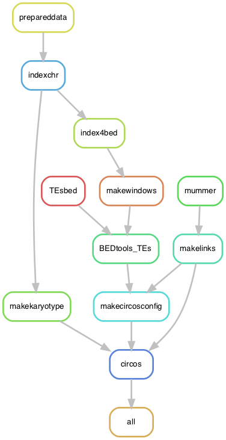

# Circos plot of *Podospora anserina* species complex 

A pipeline to produce Circos plots for all seven chromosomes of the *Podospora anserina* species complex. The annotation files come from running `PaAnnotation.smk`, specifically the repeat content ("xxxxx.repeatmasker.gff"), where "xxxxx" is the sample's name.

**WARNING** As it is, the pipeline assumes that the fasta of Podan2 (the reference genome of the strain S) doesn't have its own sample name in the contigs (eg. chromosome_1 instead of Podan2_chromosome_1) so it deals internally with that.

## Building the environment

I ran the pipeline under a [Conda](https://docs.anaconda.com/) environment in an Ubuntu environment. Install it first. If you like, you can start by updating it.

    $ conda update -n base conda

**Warning** This was done with an oldere installation of conda before the strict channel priority was a thing. Hence, installing these programs as I did might not work anymore :/. I had issues in a MacBook Pro with an M1 chip (as of Sept 2023).

To create the environment arbitrarily named `CircosSppComplex`:

    $ conda create -n CircosSppComplex -c bioconda snakemake-minimal=5.8.1

To install software, activate the environment.

    $ conda activate CircosBlock

Now install:

    $ conda install -c bioconda circos=0.69.6=1
    $ conda install -c bioconda perl-app-cpanminus=1.7044
    $ conda install -c bioconda blast=2.9.0  
    $ conda install -c bioconda mummer4=4.0.0beta2 
    $ conda install -c bioconda samtools=1.9 
    $ conda install -c bioconda bedtools=2.29.0
    $ conda install -c bioconda biopython=1.77

Some Perl packages are necessary for Circos:

    $ cpanm Clone Config::General Font::TTF::Font GD GD::Polyline Math::Bezier Math::Round Math::VecStat Params::Validate Readonly Regexp::Common SVG Set::IntSpan Statistics::Basic Text::Format

## The configuration file

The configuration file contains the paths to the necessary files to run the pipeline.

    $ cat CircosSppComplex_config.yaml
```yaml
# Configuration file of CircosSppComplex
# ==================================================
# Sandra Lorena Ament Velasquez
# 2020/07/17 - 2023/09/10
# +++++++++++++++++++++++++++++++++++++++++++++++++

## Samples
# SampleIDs: ["Podan2", "CBS237.71m"]
SampleIDs: ["Podan2", "CBS237.71m", "PcWa139m", "CBS112042p", "CBS415.72m", "CBS411.78m", "CBS124.78p"]
reference: "Podan2" 

## Path to assemblies
path2assemblies: "/mnt/sda/johannesson_lab/podospora/data/FinalAssemblies"
path2repeatmasking: "/mnt/sda/johannesson_lab/podospora/data/FinalAssemblies" # Assume files are called {sample}.repeatmasker.gff

## Template for the configuration file for Circos plot. It should containing all Circos files too
# circos.conf
# colors.conf
# colors_fonts_patterns.conf
# fonts.conf
# housekeeping.conf
# ideogram.conf
# image.conf
# patterns.conf
# ticks.conf

circosconfpath: "data/etc" # This path should also be as such in the configuration file for all the dependencies

# Third-party script to produce files ready to be read in https://dnanexus.github.io/dot/
DotPrep: "scripts/DotPrep.py"
```

## The Circos file

In the repo I'm including a folder called `circos` which in turn has a `etc` folder with all the configuration files. The pipeline produces its own karyotype file from the input fasta files in the configuration file above.

## Run pipeline locally

Get into the folder with this repo's content and activate the conda environment, for example:

    $ cd /mnt/sda/johannesson_lab/podospora/4_PhylogenyPaper/6_CircosSppComplex
    $ conda activate CircosBlock

First, to get an idea of how the pipeline looks like we can make a rulegraph. In Mac, you need to install graphviz to run the following command. For that you can do `brew install graphviz` using Homebrew, for example. It otherwise works well in Ubuntu.

    $ snakemake --snakefile CircosSppComplex.smk --configfile CircosSppComplex_config.yaml --rulegraph | dot -Tpng > rulegraph.png



For testing:

    $ snakemake --snakefile CircosSppComplex.smk --configfile CircosSppComplex_config.yaml -pn

Now you can run the pipeline. I like to make screen first, then activate the environment, and finally run the pipeline in the background.

    $ screen -R CircosSppComplex
    $ conda activate CircosBlock
    $ snakemake --snakefile CircosSppComplex.smk --configfile CircosSppComplex_config.yaml -p -j 10 --keep-going &> CircosSppComplex.log &

Notice `-j` stands for the number of threads that you want to give to your pipeline. See [Snakemake](https://snakemake.readthedocs.io/en/stable/) documentation for more information.

The results are `png` and `svg` files for the full synteny case (main figure) and for the inversions alone (supplementary) in the `circos` folder. I used the `png` file to make the main figure because it keeps the transparency values.
