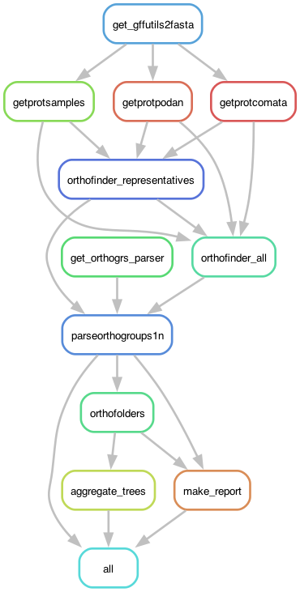

# OrthoTreesUppmax: Getting orthologs of the *Podospora anserina* species complex - Uppmax version

A general pipeline to get orthologous genes from the *P. anserina* species complex. Due to the unpredictable number of ortholog groups, the pipeline relies on a [checkpoint function](https://snakemake.readthedocs.io/en/stable/snakefiles/rules.html#data-dependent-conditional-execution). 

Briefly, the pipeline looks for the genome assemblies and their annotations, and produce fasta files with their proteins. Then OrthoFinder is run on these protein files to find single-copy orthogroups. Within each orthologous group, one of the genes should belong to the reference genome (strain S+). So I used the *nucleotide* sequence of that particular reference gene to retrieve its orthologs in the other assemblies with BLAST. This is necessary to finally obtain DNA alignments (rather than protein) of single-copy orthologs that can be used then to make gene trees.

Like my other pipelines, you need a few directories and files in the repository. 

- config -- contains the configuration file
- data -- contains a file of gene sequences from the reference genome of *P. anserina* (version Podans_v2016, strain S+) that I produced from the [Lelandais et al. (2023)](https://bmcgenomics.biomedcentral.com/articles/10.1186/s12864-022-09085-4) annotation.
- envs -- it has a couple of yaml files with instructions to make small conda environments for the pipeline (see below). They are used automatically by Snakemake.
- profile -- contains the [profile](https://snakemake.readthedocs.io/en/stable/executing/cli.html#profiles) file I used to run the pipeline in the Slurm cluster [UPPMAX](https://www.uppmax.uu.se/).

More is explained below. The pipeline will later produce other directories.

## Building the environment

I was a bit lazy on this one, so I used a combination of modules in UPPMAX and small conda environments when necessary.

	$ module load bioinfo-tools snakemake/7.25.0 MAFFT/7.407 blast/2.13.0+

Inside the pipeline I also load `OrthoFinder/2.5.2` but I can't do that externally because it crashes with the small conda environments I made for some rules:

```yaml
channels:
  - bioconda
dependencies:
  - gffutils=0.12
```

Even tho UPPMAX has the module `iqtree/2.2.0-omp-mpi`, I ran into a bug and I had to use a conda environment with a more recent version of IQ-TREE:

```yaml
channels:
  - bioconda
dependencies:
  - iqtree=2.2.3
```

## Prepare a profile file for UPPMAX (the slurm server of Uppsala University)

For this pipeline I use a [profile](https://snakemake.readthedocs.io/en/stable/executing/cli.html#profiles), which has the information necessary to run the pipeline in a slurm server, specifically Uppmax. It depends on a file called `config.yaml` in the `profile` folder.

The config.yaml file contains:

```yaml
snakefile: OrthoTreesUppmax.smk

cluster:
  mkdir -p logs/{rule} &&
  sbatch
    --account={resources.account}
    --partition={resources.partition}
    --cpus-per-task={resources.threads}
    --mem={resources.mem_mb}
    --job-name={rule}
    --error=logs/{rule}/{rule}-{wildcards}-%j.err
    --output=logs/{rule}/{rule}-{wildcards}-%j.out
    --time={resources.time}
    --parsable
default-resources:
  - account="XXXXXXXXX"
  - partition="core"
  - time="1:00:00"
  - threads=1
  - mem_mb=6800

restart-times: 0
max-jobs-per-second: 10
max-status-checks-per-second: 1
jobs: 100
keep-going: True
rerun-incomplete: True
printshellcmds: True
scheduler: greedy
use-conda: True
cluster-cancel: scancel # To automatically cancel all running jobs when you cancel the main Snakemake process 
cluster-cancel-nargs: 50
```

Where XXXXXXXXX is your UPPMAX account. Replace that!

You can run the pipeline without the profile! But keep in mind that I designed the rules to call for resources from it. But this can be easily modified if you are a bit familiar with Snakemake.

I also used a configuration file, but that is called internally in the pipeline. It's in the `config` folder.

	$ cat config/OrthoTreesUppmax_config.yaml
```yaml
	### OrthoTreesUppmax: Getting orthologs of the Podospora complex
	# ===========================================================================
	# Sandra Lorena Ament Velasquez
	# 2023/08/09
	# ++++++++++++++++++++++++++++++++++++++++++++++

	SampleIDs: ["CBS112042p", "CBS237.71m", "CBS411.78m", "CBS415.72m", "PaTgp", "PaWa137m", "PaYp", "PcWa139m", "CBS124.78p", "PaWa100p", "PaWa21m", "PaWa28m", "PaWa46p", "PaWa53m", "PaWa58m", "PaWa63p", "PaWa87p", "CBS253.71p", "CBS307.81m", "CBS333.63p", "CBS451.62p", "PcWa131m", "PcWa132p", "PcWa133m"]

	# Repeat OrthoFinder with just one representative strain per species for root-inference
  SpeciesTreeSamples: ["CBS112042p", "CBS237.71m", "CBS411.78m", "CBS415.72m", "CBS124.78p", "PODAN", "PODCO"]

	assembliespath: "path/to/genomes"
	annotationpath: "path/to/annotation"

	# Data of P. anserina and P. comata reference genomes
	PODAN: "../1_Annotation_v3/data/Podans_v2016/genomePodoMatPlus.fasta"
	PODANgff: "../1_Annotation_v3/data/Podans_v2016/genome_annotation_PODANS_v2016.gff"
	PODCO: "path/to/Podospora_comata/PODCO_genomic.fas"
	PODCOgff: "path/to/Podospora_comata/PODCO_genomic.gff3"
```

Make sure to modify the paths accordingly if you want to run the pipeline. The files from the *Podospora comata* reference genome are available in NCBI but also [here](https://github.com/johannessonlab/SpokPaper/tree/master/Fig1_3SppNetwork/references). 

## Pipeline

Go to working directory if you are not there already:

	$ cd /proj/sllstore2017101/b2015200/SnakePipelines/20a_PodoPhylogeny/1_OrthoTrees

	$ module load bioinfo-tools snakemake/7.25.0 MAFFT/7.407 blast/2.13.0+

First, to get an idea of how the pipeline looks like we can make a rulegraph:

	$ snakemake --profile profile --rulegraph | dot -Tpng > rulegraph.png



To check that the files for the pipeline are in order:

	$ snakemake --profile profile -pn

Or without the profile.

	% snakemake --snakefile OrthoTreesUppmax.smk -pn	

There are many ways of running the pipeline. In this case I'm using the profile file defined above:

	$ screen -R phylo
	$ module load bioinfo-tools snakemake/7.25.0 MAFFT/7.407 blast/2.13.0+
	$ snakemake --profile profile &> snakemake.log &
	[1] 667

## Results

In the end you should obtain two files in the directory `results`:

- OneToOne_equivalences.txt -- a table containing the name of the orthologous group alignment, the ID from OrthoFinder (e.g. OG0000534), and the gene name of the *P. anserina* reference (e.g. Pa_1_90).
- SingleGeneTrees.tre -- a file containing all the IQ-TREE gene trees produced from the single-copy orthologs.

These two files I included in the repository.

The pipeline actually runs OrthoFinder twice: one with all genomes, and one with just one representative per species (directory `OrthoFinder`. I was experiment with the results of this pipeline, hence I produced both. But I ended up using only the results from the "one-per-species" run. Other directories produced by the pipeline are self-explanatory. For example, the directory `iqtree` contains individual files for all trees, and `alignments` has all the fasta alignments per gene.

## Additional notes

I also ran this pipeline with the *Cercophora samala* sample, but I ran into some problems retrieving the fasta sequence of 38 orthogroups. I decided to exclude them from further analyses.


