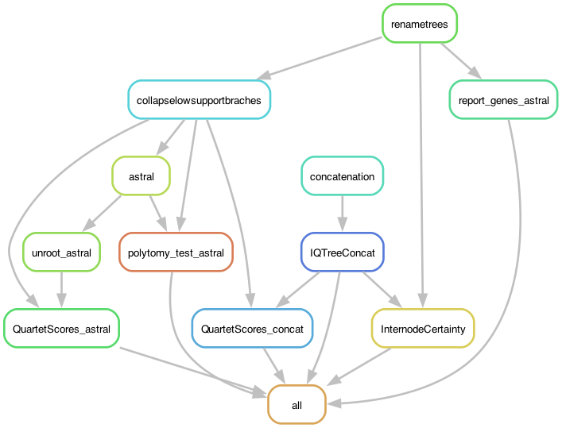

# PodoPhylogeny: Making a phylogeny of the *Podospora anserina* species-complex

The continuation of the `OrthoTreesUppmax.smk` pipeline to produce a ML supermatrix and MSC ASTRAL trees from the *P. anserina* species complex, using the previously produced gene trees and alignments.

Briefly, the pipeline selects a user-defined number of random orthogroups and produces a supermatrix to make a phylogeny. It also uses all orthogroups that have all samples to make an ASTRAL tree. It then calculates a number of statistics.

## Building the environment

In this pipeline I'll use a conda environment.

    $ conda create -n PodoPhylogeny -c bioconda snakemake-minimal=7.32.3 ete3=3.1.3 newick_utils=1.6 biopython=1.81 iqtree=2.2.3 raxml=8.2.12
    $ conda activate PodoPhylogeny

*Edit 2023.08.25:* I encountered a bug with the profiles and snakemake v. 7.32.3 not present in e.g. 7.25.0. With this version, the profile file is not found. Maybe a higher Snakemake version is advisable.

ASTRAL is not in conda, so I downloaded the program from the [ASTRAL GitHub](https://github.com/smirarab/ASTRAL) and copied locally (along with its lib folder):

    $ ls bin/
    astral.5.7.3.jar  lib

This directory is not in the repository.

## Prepare a profile file for Uppmax (the slurm server of Uppsala University)

For this pipeline I use a [profile](https://snakemake.readthedocs.io/en/stable/executing/cli.html#profiles), which has the information necessary to run the pipeline in a slurm server, specifically Uppmax. It depends on a file called `config.yaml` in the `profile` folder.

The config.yaml file contains:

```yaml
snakefile: PodoPhylogeny.smk

cluster:
  mkdir -p logs/{rule} &&
  sbatch
    --account={resources.account}
    --partition={resources.partition}
    --cpus-per-task={resources.threads}
    --mem={resources.mem_mb}
    --job-name={rule}
    --error=logs/{rule}/{rule}-{wildcards}-%j.err
    --output=logs/{rule}/{rule}-{wildcards}-%j.out
    --time={resources.time}
    --parsable
default-resources:
  - account="XXXXXXXXX"
  - partition="core"
  - time="1:00:00"
  - threads=1
  - mem_mb=6800

restart-times: 0
max-jobs-per-second: 10
max-status-checks-per-second: 1
jobs: 100
keep-going: True
rerun-incomplete: True
printshellcmds: True
scheduler: greedy
use-conda: True
cluster-cancel: scancel # To automatically cancel all running jobs when you cancel the main Snakemake process 
cluster-cancel-nargs: 50
```

Where XXXXXXXXX is your UPPMAX account. Replace that!

You can run the pipeline without the profile (using `--snakefile PodoPhylogeny.smk`! But keep in mind that I designed the rules to call for resources from it. But this can be easily modified if you are a bit familiar with Snakemake.

I also used a configuration file, but that is called internally in the pipeline. It's in the `config` folder.

	$ cat config/PodoPhylogeny_config.yaml
```yaml
### PodoPhylogeny: Exploring the phylogenies of paralogs in the *Podospora* complex
# ===========================================================================
# Sandra Lorena Ament Velasquez
# 2023/10/23
# ++++++++++++++++++++++++++++++++++++++++++++++

SampleIDs: ["PODAN", "PODCO", "CBS112042p", "CBS237.71m", "CBS411.78m", "CBS415.72m", "PaTgp", "PaWa137m", "PaYp", "PcWa139m", "CBS124.78p", "PaWa100p", "PaWa21m", "PaWa28m", "PaWa46p", "PaWa53m", "PaWa58m", "PaWa63p", "PaWa87p", "CBS253.71p", "CBS333.63p", "CBS451.62p", "PcWa131m", "PcWa132p", "PcWa133m", "PaZp", "CBS433.50p", "CBS455.64m"]

# Output results from the OrthoTreesUppmax.smk pipeline
treesfile: "../4_OrthoTrees/results/SingleGeneTrees.tre"
OrthoTreesPath: "../4_OrthoTrees"
orthoreport: "../4_OrthoTrees/results/OneToOne_equivalences.txt"

# Number of sample orthologs
SAMPLEsize: 1000

# Support filter for collapsing branches
MINsupport: 95

# Local installations
astral: "bin/Astral/astral.5.7.8.jar"
quartetscores: "bin/QuartetScores/QuartetScores"
```

To run the pipeline with the outgroup, just add "CBS307.81m" to the list of SampleIDs.

## Pipeline

Activate your environment. Go to the working directory.

	$ conda activate PodoPhylogeny

First, to get an idea of how the pipeline looks like we can make a rulegraph. In Mac, you need to install graphviz to run the following command. For that you can do `brew install graphviz` using Homebrew, for example. It otherwise works well in Ubuntu.

	$ snakemake --profile profile --rulegraph | dot -Tpng > rulegraph.png



To check that the files for the pipeline are in order:

	$ snakemake --profile profile -pn

There are many ways of running the pipeline. In this case I'm using the profile file defined above:

	$ screen -R podophylo
	$ conda activate PodoPhylogeny
	$ snakemake --profile profile &> snakemake.log &
	[1] 40055

But at some point I started having an issue with the profile :/.

    $ snakemake --profile profile --snakefile PodoPhylogeny.smk &> snakemake.log &

## Results

The names depend on the `MINsupport` variable set in the configuration file. In the paper I used ` MINsupport = 95`. The pipeline will create a list of randomly selected genes (number set with variable `SAMPLEsize=1000` in the configuration file). When doing this, it creates the file `concatenated/genes_selected.txt` with the list of randomly chosen genes. If the file is already present, the pipeline will use it instead of selecting new genes. I provide the files I used for the paper (with and without C. samala) in the repository.

*Trees*
- `concatenated/onetoones.treefile` -- ML supermatrix phylogeny used in the paper with 1000 UFBoot scores.
- `astral/astral.bb{MINsupport}.tre` -- MSC astral tree used in the paper with local posterior probabilities.


*Statistics*
- `astral/astral.{MINsupport}.scored.log` -- An annotated version of the MSC tree. The branch annotations correspond to alternative quartet topologies (option -t 8 from ASTRAL). Not used in the paper.
- `astral/astral.bb{MINsupport}.poly.tre` -- Test the null hypothesis of polytomy (see doi:10.3390/genes9030132). Not used in the paper.
- `results/RAxML_IC_Score_BranchLabels.onetoones.tre` -- Annotated ML supermatrix phylogeny with the original internode certainty scores (using RAxML). Not used in the paper.
- `results/Concatenated1000.bb{MINsupport}_QuartetScores.tre` -- Annotated ML supermatrix phylogeny with quartet internode certainty scores (Zhou et al. 2020 Systematic Biology). Here you find the EQP-IC scpres used in the paper!!
- `results/AstralAll.bb{MINsupport}_QuartetScores.tre` -- Annotated MSC phylogeny with quartet internode certainty scores (Zhou et al. 2020 Systematic Biology). Here you find the EQP-IC scpres used in the paper!!

*Reports*

- `results/OneToOne_astral.txt` -- a report of the genes used for the ASTRAL analysis -- I provide that in the repository for clarity (but without and with the outgroup C. samala).


## Visualizing the IC trees

I usually use [FigTree](http://tree.bio.ed.ac.uk/software/figtree/) to visualize trees, but the outputs with the statistics are not standard. I ended up manually editing the trees to make them compatible. To achive this quickly, I used the text editor [Sublime Text 4](https://www.sublimetext.com/).

So I opened the IC tree in Sublime. I searched for `\[.*?\]` or `\[.*?*\]` using regex in Sublime (click on `Find All` to select all matches) and move them before the branch lengths, not after (before the colon), and I added quotation marks.

Example from a similar tree:

    (Zopfiella_longicuadata_CBS252.57:0.00000117680000000000,Zopfiella_longicaudata_CBS257.78:0.00000164130000000000):0.00000117680000000000[1.000,1.000]

    (Zopfiella_longicuadata_CBS252.57:0.00000117680000000000,Zopfiella_longicaudata_CBS257.78:0.00000164130000000000)"[1.000,1.000]":0.00000117680000000000

Where in the branch label [x,y], x contains the IC score and y the IC-All score.

## Visualizing the QuartetScores trees

As above, but this time QuartetScores left the original support values in there so those have to be removed first and replaced with the scores.

First I used the regex `\)[0-9\.]+` in Sublime to find them (Cmd+F with `.*` activated in Mac). Click on "Find All" to select all instances. Then removed them, but leaving behind the starting `)`! Importantly, right after replacing the regex with `)`, hit enter for a new line! Here is a piece of the a tree as an example (not the whole tree!):

    (PaWa46p:1,(PaWa58m:1,(PaWa53m:1,(PODAN:1,(PaWa100p:1,PaWa87p:1)0.85045:0.012348[qp-ic:0.000353;lq-ic:-0.005802;eqp-ic:0.000353])0.60102:0.029418[qp-ic:0.001014;lq-ic:-0.017064;eqp-ic:0.001014])0.90198:0.012298[qp-ic:0.000195;lq-ic:-0.024506;eqp-ic:0.000195])0.74045:0.022628[qp-ic:0.000568;lq-ic:-0.024506;eqp-ic:0.000568])0.98521:0.004085[qp-ic:0.000025;lq-ic:-0.030555;eqp-ic:0.000025])0.07347:0.06762[qp-ic:0.003943;lq-ic:-0.024506;eqp-ic:0.003943])0.17935:0.03477[qp-ic:0.002352;lq-ic:-0.024506;eqp-ic:0.002352])0.39233:0.021418[qp-ic:0.001190;lq-ic:-0.024506;eqp-ic:0.001190])0.00001:0.100728[qp-ic:0.013406;lq-ic:0.002302;eqp-ic:0.009978])0:4.350389[qp-ic:0.950286;lq-ic:0.931214;eqp-ic:0.716767])0:1.65346[qp-ic:0.578198;lq-ic:0.495176;eqp-ic:-0.462716],((CBS411.78m:1,(CBS124.78p:1,CBS253.71p:1)0:3.856496[qp-ic:0.924406;lq-ic:0.923956;eqp-ic:0.924406])0:5.793863[qp-ic:0.986285;lq-ic:0.983854;eqp-ic:0.858506],CBS415.72m:1)0:1.296937[qp-ic:0.456540;lq-ic:0.321476;eqp-ic:-0.301702])0:0.290557[qp-ic:0.157951;lq-ic:0.134293;eqp-ic:-0.631648]):1[eqp-ic:-0.631648]);

    (PaWa46p:1,(PaWa58m:1,(PaWa53m:1,(PODAN:1,(PaWa100p:1,PaWa87p:1)
    :0.012348[qp-ic:0.000353;lq-ic:-0.005802;eqp-ic:0.000353])
    :0.029418[qp-ic:0.001014;lq-ic:-0.017064;eqp-ic:0.001014])
    :0.012298[qp-ic:0.000195;lq-ic:-0.024506;eqp-ic:0.000195])
    :0.022628[qp-ic:0.000568;lq-ic:-0.024506;eqp-ic:0.000568])
    :0.004085[qp-ic:0.000025;lq-ic:-0.030555;eqp-ic:0.000025])
    :0.06762[qp-ic:0.003943;lq-ic:-0.024506;eqp-ic:0.003943])
    :0.03477[qp-ic:0.002352;lq-ic:-0.024506;eqp-ic:0.002352])
    :0.021418[qp-ic:0.001190;lq-ic:-0.024506;eqp-ic:0.001190])
    :0.100728[qp-ic:0.013406;lq-ic:0.002302;eqp-ic:0.009978])
    :4.350389[qp-ic:0.950286;lq-ic:0.931214;eqp-ic:0.716767])
    :1.65346[qp-ic:0.578198;lq-ic:0.495176;eqp-ic:-0.462716],((CBS411.78m:1,(CBS124.78p:1,CBS253.71p:1)
    :3.856496[qp-ic:0.924406;lq-ic:0.923956;eqp-ic:0.924406])
    :5.793863[qp-ic:0.986285;lq-ic:0.983854;eqp-ic:0.858506],CBS415.72m:1)
    :1.296937[qp-ic:0.456540;lq-ic:0.321476;eqp-ic:-0.301702])
    :0.290557[qp-ic:0.157951;lq-ic:0.134293;eqp-ic:-0.631648]):1[eqp-ic:-0.631648]);

Then, if present, I manually push the `:1` in the root to a new line.

    (PaWa46p:1,(PaWa58m:1,(PaWa53m:1,(PODAN:1,(PaWa100p:1,PaWa87p:1)
    :0.012348[qp-ic:0.000353;lq-ic:-0.005802;eqp-ic:0.000353])
    :0.029418[qp-ic:0.001014;lq-ic:-0.017064;eqp-ic:0.001014])
    :0.012298[qp-ic:0.000195;lq-ic:-0.024506;eqp-ic:0.000195])
    :0.022628[qp-ic:0.000568;lq-ic:-0.024506;eqp-ic:0.000568])
    :0.004085[qp-ic:0.000025;lq-ic:-0.030555;eqp-ic:0.000025])
    :0.06762[qp-ic:0.003943;lq-ic:-0.024506;eqp-ic:0.003943])
    :0.03477[qp-ic:0.002352;lq-ic:-0.024506;eqp-ic:0.002352])
    :0.021418[qp-ic:0.001190;lq-ic:-0.024506;eqp-ic:0.001190])
    :0.100728[qp-ic:0.013406;lq-ic:0.002302;eqp-ic:0.009978])
    :4.350389[qp-ic:0.950286;lq-ic:0.931214;eqp-ic:0.716767])
    :1.65346[qp-ic:0.578198;lq-ic:0.495176;eqp-ic:-0.462716],((CBS411.78m:1,(CBS124.78p:1,CBS253.71p:1)
    :3.856496[qp-ic:0.924406;lq-ic:0.923956;eqp-ic:0.924406])
    :5.793863[qp-ic:0.986285;lq-ic:0.983854;eqp-ic:0.858506],CBS415.72m:1)
    :1.296937[qp-ic:0.456540;lq-ic:0.321476;eqp-ic:-0.301702])
    :0.290557[qp-ic:0.157951;lq-ic:0.134293;eqp-ic:-0.631648])
    :1[eqp-ic:-0.631648]);

Now I use the regex `\[.*?\]` to select the scores (click on Select All), cut them, then I go to the begining of the line (that now starts with `:`) and paste them there **within quotation marks**. Then jump to the end of the lines and remove the new lines.

    (PaWa46p:1,(PaWa58m:1,(PaWa53m:1,(PODAN:1,(PaWa100p:1,PaWa87p:1)"[qp-ic:0.000353;lq-ic:-0.005802;eqp-ic:0.000353]":0.012348)"[qp-ic:0.001014;lq-ic:-0.017064;eqp-ic:0.001014]":0.029418)"[qp-ic:0.000195;lq-ic:-0.024506;eqp-ic:0.000195]":0.012298)"[qp-ic:0.000568;lq-ic:-0.024506;eqp-ic:0.000568]":0.022628)"[qp-ic:0.000025;lq-ic:-0.030555;eqp-ic:0.000025]":0.004085)"[qp-ic:0.003943;lq-ic:-0.024506;eqp-ic:0.003943]":0.06762)"[qp-ic:0.002352;lq-ic:-0.024506;eqp-ic:0.002352]":0.03477)"[qp-ic:0.001190;lq-ic:-0.024506;eqp-ic:0.001190]":0.021418)"[qp-ic:0.013406;lq-ic:0.002302;eqp-ic:0.009978]":0.100728)"[qp-ic:0.950286;lq-ic:0.931214;eqp-ic:0.716767]":4.350389)"[qp-ic:0.578198;lq-ic:0.495176;eqp-ic:-0.462716]":1.65346,((CBS411.78m:1,(CBS124.78p:1,CBS253.71p:1)"[qp-ic:0.924406;lq-ic:0.923956;eqp-ic:0.924406]":3.856496)"[qp-ic:0.986285;lq-ic:0.983854;eqp-ic:0.858506]":5.793863,CBS415.72m:1)"[qp-ic:0.456540;lq-ic:0.321476;eqp-ic:-0.301702]":1.296937)"[qp-ic:0.157951;lq-ic:0.134293;eqp-ic:-0.631648]":0.290557)"[eqp-ic:-0.631648]":1);

Now it should be readable in FigTree.